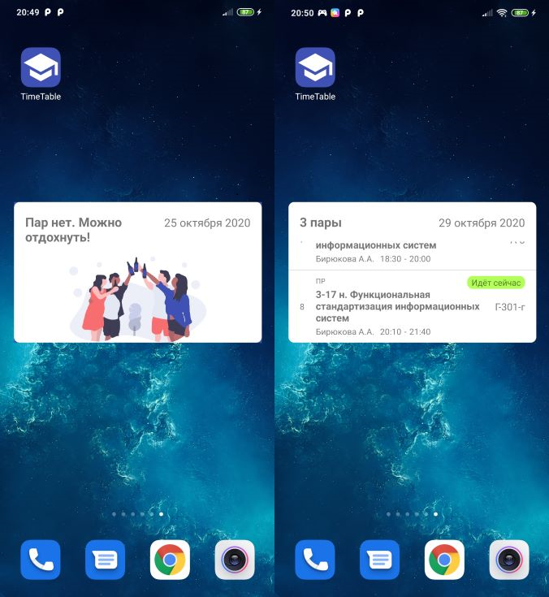

TimeTable
=========
Приложение для просмотра университетского расписания, работающее под операционной системой Android. Пример расписания, находится в папке Assets.

Требования
----------
* Android Studio 4.0
* Gradle Plugin 3.6
* Kotlin Plugin 1.3

В приложении используется библиотека Apache POI. Для запуска проекта необходимо загрузить эту библиотеку [отсюда](https://www.apache.org/dyn/closer.cgi/poi/release/bin/poi-bin-3.12-20150511.zip). Далее архив библиотеки нужно извлечь в папку libs. (Путь папки, где должны оказаться файлы архива TimeTable/app/libs)

Демонстрация
------------

Виджет
------
У приложения есть виджет, который поможет не забыть, какие занятия вам предстоят сегодня.

